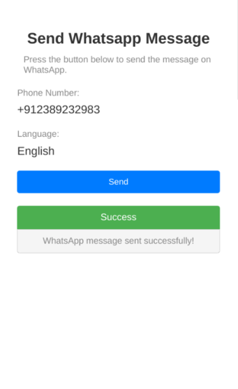

# WhatsApp Message Plugin
{: .no_toc }

## Table of Contents
{: .no_toc .text-delta }

1. TOC
{:toc}

## Preview

## Description

This plugin simplifies the process of connecting the [Turn platform](https://www.turn.io/) to your SurveyCTO forms, allowing you to send WhatsApp template messages effortlessly. It enables you to send pre-approved template messages to WhatsApp users, facilitating friendly reminders and promoting interaction with your WhatsApp service. This engagement, in turn, enhances participant engagement and improves data quality.

[Turn](https://www.turn.io/) is a powerful platform that enables organizations to send WhatsApp messages at scale through approved templates and automated workflows.

## Download

{: .warning }
**Note**: Ensure the file name doesn't contain any trailing numbers like `(1)`, `(2)` which are automatically added by your system if you already have the plugin downloaded. Remove these and ensure the file name follows the format: `wa-message.fieldplugin.zip`

## Testing the Plugin

For general testing steps, please refer to the [Trying Out the Plugins](../trying-out-plugins.md) guide.

## Configuration

### Obtaining API Credentials

Before using this plugin in production, you need to obtain the correct API credentials:

- **`apiToken`**: Follow these steps to access Turn API credentials:
  1. Navigate to the Settings page
  2. Click on the 'API & Webhooks' tab
  3. Scroll down to the 'Authentication Tokens for X Whatsapp Line' section
  4. Locate and click the 'Create a Token' button
  5. Set the name for the token as 'SCTO WA Message Plugin'
  6. Ensure you set an expiry date well into the future to prevent it from expiring during the SurveyCTO survey's active period
  7. The value you'll obtain here will be used for `apiToken` field

- **`whatsappNamespaceId`**: Contact [Abhishek](https://github.com/abhishek-compro) to obtain the correct WhatsApp Namespace ID for your environment

{: .important }
**Note**: These values are currently set to placeholder/default values in the test form and need to be configured properly for the plugin to function correctly in production.

### Required Parameters

The following parameters need to be configured in your form:

| Key                   | Value                                                                                                                                                                                                  |
| --------------------- | ------------------------------------------------------------------------------------------------------------------------------------------------------------------------------------------------------ |
| `phoneNumber`         | This is the phone number that will receive the WhatsApp template message.                                                                                                                              |
| `countryCode`         | This is the country code for the phone number. It will be automatically added to the phone number when sending a message on WhatsApp using that specific form. For example, it could be `91` or `880`. |
| `apiUrl`              | This is the URL of the API endpoint that will be invoked to send the WhatsApp message. Can be set to `https://whatsapp.turn.io/v1/messages`.                                                                                                                 |
| `apiToken`            | This is the authentication token for the [Turn](https://www.turn.io/) Account associated with the WhatsApp Line where the template is located.                                                         |
| `whatsappNamespaceId` | This is the WhatsApp Namespace ID where the template message is located.                                                                                                                               |
| `whatsappTemplateId`  | This is the WhatsApp Template Message ID, which will be used for sending a message to the user on WhatsApp.                                                                                            |
| `language`            | This language code specifies the language in which the template message should be sent.                                                                                                                |

## Test Form
[Sample WA Message Plugin Form](./extras/test-form/wa-message-plugin-demo.xlsx)

## Developer Notes

### Templates with Variables

If you want to use templates with dynamic variables, you'll need to modify the `createPayload` method in [`script.js`](./source/script.js). Here's how to implement this:

1. **Collect Variable Values**: Add form inputs to collect the variable values from users
2. **Pass to Plugin**: Pass these variables to the plugin definition as additional parameters
3. **Access in Script**: Use `getPluginParameter` in `script.js` to retrieve the variable values
4. **Modify Payload**: Update the `createPayload` method to include these variables in the message template