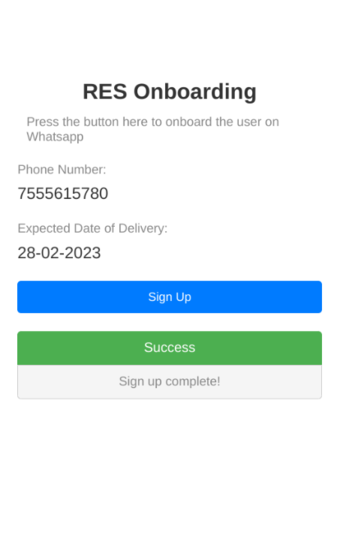

# Description
The **RES Signup Plugin** is a field plugin designed to directly onboard users to NooraHealth's Remote Engagement Service (RES) directly from SurveyCTO forms. This plugin enables the teletraining team across different countries to efficiently inform and onboard users to RES, thereby increasing the number of onboarded users for the service.

## Required parameters

| Key                     | Mandatory / Optional    |              Value                                                                                                          |
| ----------------------- | ----------------------- |---------------------------------------------------------------------------------------------------------------------------- |
| `phoneNumber`           |      Mandatory          |  Pass the phone number that needs to be onboarded to RES                                                                    |
| `dueDate`               |      Optional           |  This is the due date that will be used to schedule the RES Campaign for the user.                                          |
| `country`               |      Optional           |  This is the country name, eg: India, Bangladesh                                                                            |
| `referenceMobileNumber` |      Optional           |  This is the mobile number that was previously signed up to our service using RCH data and is now being referenced.         |
| `state`                 |      Optional           |  This will be the state in which the user resides.                                                                          |
| `language`              |      Mandatory          |  This language code specifies the language that will be used to set the language preference of the user for the RES campaign|
| `program`               |      Mandatory          | This is the program for which the user will be registered. Eg.: GHW, MCH etc.                                               |
| `conditionArea`         |      Mandatory          | This specifies the condition area of the user, which will be stored in the backend as part of the user's preferences.       |
| `callId`                |      Mandatory          | This is a unique call ID generated for the user, which is required by the API.                                              |
| `apiUrl`                |      Mandatory          | This is the URL of the API endpoint that will be invoked to onboard the user to RES.                                        |

## More resources

* **Test form**:
  [Sample RES Onboarding Form](./extras/test-form/wa-onboarding-plugin-demo.xlsx)
